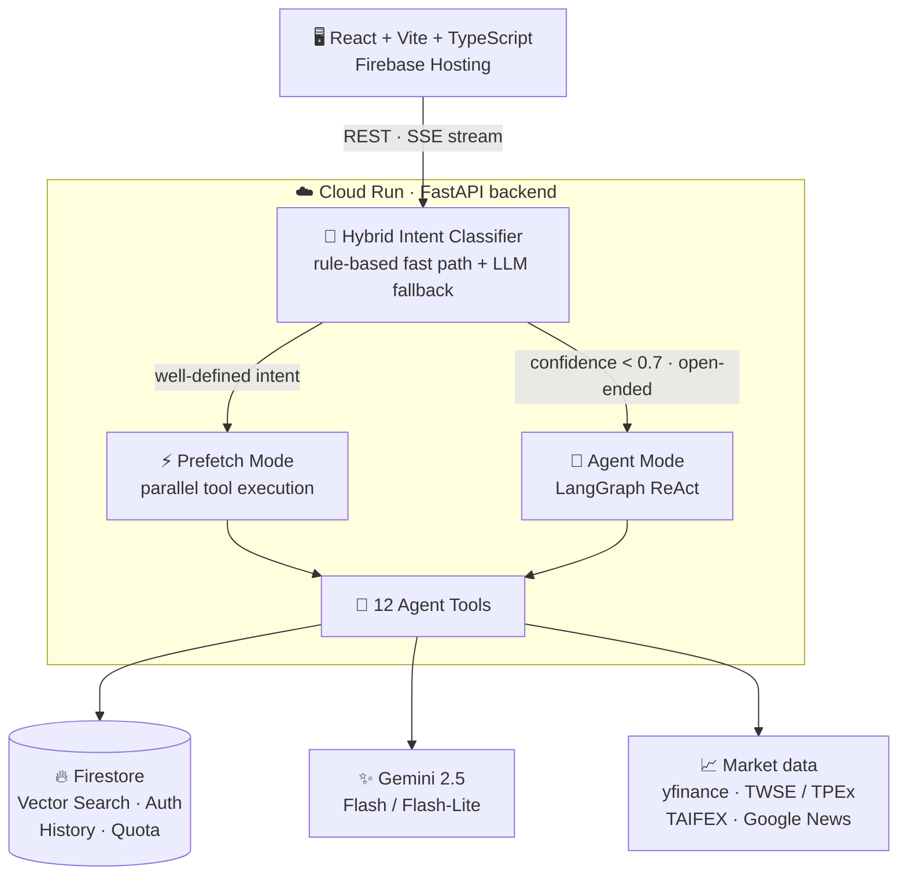
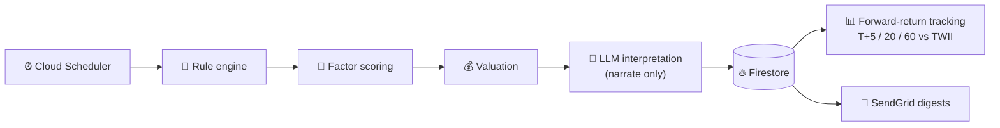

# 🧚 Navi — AI-Powered Stock Analyzer

_Named after Navi, the fairy guide in **The Legend of Zelda: Ocarina of Time** — a small companion that points you toward what matters._

**Navi is a full-stack, LLM-agent stock-analysis assistant for the Taiwan market.** Each natural-language question is routed by a **hybrid intent classifier** between a low-latency **parallel-tool Prefetch** path and an autonomous **LangGraph ReAct agent** (12 tools) — every answer grounded in a RAG knowledge base and live market data, streamed to the browser over SSE. A separate **deterministic quant screener** ranks stocks with an explicit rule engine; the LLM only _narrates_ the numbers, it never selects them.

<p>
  <a href="https://github.com/dddenrose/Navi/actions/workflows/ci.yml"></a>
  
  
  
  
  
  
  
  
</p>

### 🔗 [Live Demo](https://navi-stock-analyzer.web.app) — no sign-up needed, click _"以訪客身分體驗"_ (guest mode) &nbsp;·&nbsp; [繁體中文 README](README.zh-TW.md)


> ⚠️ **Disclaimer** — For learning and research only. All analysis is generated by software and **does not constitute investment advice**. Invest at your own risk.

---

## ✨ Features

- **AI Chat Analysis** — Ask questions in natural language; a hybrid intent classifier auto-routes to the optimal response mode (Prefetch parallel tools or LangGraph ReAct Agent), combining RAG knowledge base with real-time data via SSE Streaming
- **Hybrid Intent Classification** — Two-stage classifier (rule-based fast path + LLM fallback) covering 10 intent categories with confidence scoring; low-confidence queries auto-fallback to full Agent mode
- **AI Stock Screener** — Scheduled multi-stage pipeline (rules → factor scoring → valuation → AI interpretation) that surfaces `value` and `momentum` picks per industry. The AI never black-boxes the selection: a deterministic rule engine filters, scores, and ranks, then the LLM only translates the numbers into readable analysis. Includes **forward performance tracking** (T+5/20/60 returns vs. TWII benchmark, no survivorship/look-ahead bias) and optional **email digests**
- **Curated Investment Knowledge Base** — 24 Markdown documents across 8 categories (technical / fundamental / investment theory / Taiwan market / macro / agent persona / compliance / tool interpretation), auto-quoted by the agent for entry-analysis & comprehensive-analysis questions
- **Chinese Stock Name Resolution** — Dynamically resolves Chinese company names to ticker codes via TWSE + TPEx APIs (~2,400 stocks, 24h cache)
- **Technical Analysis** — RSI, MACD, KD, moving averages, Bollinger Bands, Fibonacci retracement, 5-source support/resistance levels (MA, Bollinger, swing points, Fibonacci, psychological levels), and auto-calculated stop-loss with risk/reward ratio
- **Fundamental Analysis** — PE, PB, ROE, EPS, revenue growth, and 3-tier fair value estimation (cheap / fair / expensive based on PE percentile × EPS)
- **Institutional Tracking** — Integrates with TWSE/OTC APIs to fetch institutional investor (foreign, investment trust, dealer) buy/sell data and margin trading info (balance, utilization rate, margin offset)
- **Macro / Market Overview** — Whole-market indicators: index quotes, aggregate institutional flows (foreign / trust / dealer), and TAIFEX futures open-interest positioning
- **Financial News** — Real-time financial news search via Google News RSS
- **Portfolio Tracking** — Record holdings and transactions with real-time market value, allocation %, and **realized P/L**; buy/sell automatically computes Taiwan-market fees (0.1425%, min NT$20) and sell-side transaction tax (0.3%) using average-cost basis. The AI agent can query your positions directly
- **Strategy Backtesting (in-chat)** — Ask the agent to backtest MA crossover, RSI, MACD, or custom-condition strategies; returns full metrics (return, Sharpe ratio, max drawdown, win rate) with execution assumptions disclosed (fees, taxes, slippage, next-open fills to avoid look-ahead bias). Exposed only as an agent tool, so the LLM always interprets the numbers against the knowledge base rather than handing back a bare metrics table
- **User Tiers, Quota & Feature Access** — Per-user daily message quotas and feature gating by tier (free / pro / unlimited / admin); LLM model is selected by tier for cost control (Flash-Lite for free, Flash for paid)
- **Admin Console** — Web back office for user management, quota configuration, feature-flag control, usage summaries, and audit logs
- **Conversation History** — Multi-turn conversations persisted per-user in Firestore with full history retrieval API

---

## 🏗️ Architecture



Alongside the request-driven chat path, a **scheduled Screener pipeline** runs
independently (Cloud Scheduler → Cloud Run): rule engine → factor scoring →
valuation → AI interpretation → Firestore, with forward-return tracking and
optional SendGrid email digests to subscribers.



### Dual-Mode Dispatch

The **Hybrid Intent Classifier** (rule-based fast path + LLM fallback) analyzes each user question across 10 categories with confidence scoring, then routes to one of two modes:

- **Prefetch Mode** — For well-defined intents (e.g. entry analysis, comprehensive analysis): runs all required tools in parallel (including auto knowledge-base lookup) and synthesizes results with a structured Chain-of-Thought prompt that mandates KB-grounded reasoning. Lower latency, higher consistency.
- **Agent Mode** — For open-ended or low-confidence queries: a LangGraph `create_react_agent` autonomously decides which of the 12 tools to call (including `search_knowledge`). More flexible.

### 12 Agent Tools

| Tool                             | Description                                                                              |
| -------------------------------- | ---------------------------------------------------------------------------------------- |
| `get_stock_price`                | Real-time stock price, change %, volume, market cap                                      |
| `analyze_technicals`             | MA, RSI, MACD, KD, Bollinger Bands, Fibonacci retracement, support/resistance, stop-loss |
| `analyze_fundamentals`           | PE, PB, ROE, EPS, growth rates, 3-tier fair value (cheap/fair/expensive)                 |
| `search_knowledge`               | RAG vector search across **24 investment knowledge documents in 8 categories** (top-5)   |
| `get_institutional`              | Foreign, investment trust, dealer buy/sell data (TWSE/OTC API)                           |
| `get_margin_trading`             | Margin balance, utilization rate, short selling, margin offset                           |
| `search_financial_news`          | Financial news via Google News RSS                                                       |
| `get_portfolio`                  | User portfolio with real-time P/L and allocation breakdown                               |
| `run_strategy_backtest`          | Backtest with MA crossover / RSI / MACD / custom strategies                              |
| `get_market_overview`            | Whole-market index quote (intraday / latest close)                                       |
| `get_market_institutional_flows` | Aggregate market-wide institutional buy/sell (foreign / trust / dealer)                  |
| `get_market_futures_positions`   | TAIFEX index-futures open-interest positioning (TXF / MXF / TMF)                         |

---

## 🛠️ Tech Stack

### Backend

| Category      | Technology                                |
| ------------- | ----------------------------------------- |
| Language      | Python 3.12                               |
| Web Framework | FastAPI 0.115+                            |
| AI Framework  | LangChain 1.x + LangGraph (ReAct Agent)   |
| LLM           | Gemini 2.5 Flash / Flash-Lite (via Vertex AI) |
| Embedding     | text-embedding-004 (768 dimensions)       |
| Vector DB     | Firestore Vector Search                   |
| Data Sources  | yfinance · TWSE/OTC API · Google News RSS |

### Frontend

| Category         | Technology              |
| ---------------- | ----------------------- |
| Framework        | React 19 + TypeScript   |
| Build Tool       | Vite 7                  |
| Styling          | Tailwind CSS 4          |
| Charts           | Recharts                |
| Routing          | React Router DOM 7      |
| State Management | Zustand                 |
| Auth             | Firebase Authentication |

### Infrastructure

| Category         | Technology                       |
| ---------------- | -------------------------------- |
| Backend Hosting  | Google Cloud Run (asia-east1)    |
| Frontend Hosting | Firebase Hosting (CDN + headers) |
| CI/CD            | Google Cloud Build               |
| Database         | Firestore                        |
| Scheduling       | Google Cloud Scheduler (screener run / track / notify) |
| Email            | SendGrid (screener digests)      |
| Containerization | Docker                           |

---

## 📡 API Endpoints

`Auth` column: ✓ = Firebase JWT · **Admin** = admin role · **Token** = Cloud Scheduler shared-secret · ✗ = public.

### Chat

| Path                                    | Method | Description               | Auth |
| --------------------------------------- | ------ | ------------------------- | ---- |
| `/api/chat`                             | POST   | SSE streaming chat        | ✓    |
| `/api/chat/quota`                       | GET    | Current user's daily quota status | ✓ |
| `/api/chat/conversations`               | GET    | List user conversations   | ✓    |
| `/api/chat/conversations/{id}/messages` | GET    | Get conversation history  | ✓    |
| `/api/chat/conversations/{id}`          | DELETE | Delete a conversation     | ✓    |

### Stock

| Path                              | Method | Description                     | Auth |
| --------------------------------- | ------ | ------------------------------- | ---- |
| `/api/stock/search`               | GET    | Search TW tickers / names       | ✓    |
| `/api/stock/{ticker}`             | GET    | Stock overview (price, change)  | ✓    |
| `/api/stock/{ticker}/technical`   | GET    | Technical indicators            | ✓    |
| `/api/stock/{ticker}/fundamental` | GET    | Fundamental ratios + fair value | ✓    |
| `/api/stock/{ticker}/institutional` | GET  | Institutional buy/sell (N days) | ✓    |
| `/api/stock/{ticker}/margin`      | GET    | Margin trading (N days)         | ✓    |

### Portfolio

| Path                              | Method     | Description                       | Auth |
| --------------------------------- | ---------- | -------------------------------- | ---- |
| `/api/portfolio`                  | GET        | Portfolio with real-time P/L     | ✓    |
| `/api/portfolio/holdings`         | GET/POST   | List / add holdings              | ✓    |
| `/api/portfolio/holdings/{id}`    | PUT/DELETE | Update / delete a holding        | ✓    |
| `/api/portfolio/transactions`     | GET/POST   | List / record buy-sell transactions (fees + tax) | ✓ |
| `/api/portfolio/transactions/estimate` | GET   | Estimate fees/tax for a transaction | ✓ |

### Knowledge

| Path                       | Method | Description               | Auth |
| -------------------------- | ------ | ------------------------- | ---- |
| `/api/knowledge/stats`     | GET    | Knowledge base statistics | ✓    |

### Screener

| Path                                          | Method | Description                          | Auth  |
| --------------------------------------------- | ------ | ------------------------------------ | ----- |
| `/api/screener/run`                           | POST   | Trigger a screener run (Stage 1→2→3) | Token |
| `/api/screener/reports`                       | GET    | List recent reports                  | ✓     |
| `/api/screener/reports/latest`                | GET    | Latest report for a profile          | ✓     |
| `/api/screener/reports/{id}`                  | GET    | Report detail (picks by industry)    | ✓     |
| `/api/screener/reports/{id}/picks/{ticker}`   | GET    | Single pick detail                   | ✓     |
| `/api/screener/track`                         | POST   | Update forward-return tracking       | Token |
| `/api/screener/tracking/summary`              | GET    | Pick performance stats (win rate, excess) | ✓ |
| `/api/screener/subscriptions`                 | GET/PUT | Get / update email subscription     | ✓     |
| `/api/screener/notify`                        | POST   | Email latest report to subscribers   | Token |
| `/api/screener/unsubscribe`                   | GET    | One-click unsubscribe (HMAC token)   | ✗     |

### Features & Admin

| Path                                        | Method | Description                     | Auth  |
| ------------------------------------------- | ------ | ------------------------------- | ----- |
| `/api/features/access`                      | GET    | Effective feature access for user | ✓   |
| `/api/admin/me`                             | GET    | Current admin identity          | Admin |
| `/api/admin/users`                          | GET    | List users                      | Admin |
| `/api/admin/users/{uid}`                    | GET/PATCH | Get / update user (tier, status) | Admin |
| `/api/admin/quota-configs`                  | GET    | List quota configs              | Admin |
| `/api/admin/quota-configs/{tier}`           | PUT    | Update a tier's quota           | Admin |
| `/api/admin/feature-access-configs`         | GET    | List feature-access configs     | Admin |
| `/api/admin/feature-access-configs/{key}`   | PUT    | Update a feature's access rule  | Admin |
| `/api/admin/usage/summary`                  | GET    | Aggregate usage summary         | Admin |
| `/api/admin/logs`                           | GET    | Audit / request logs            | Admin |

### System

| Path      | Method | Description  | Auth |
| --------- | ------ | ------------ | ---- |
| `/health` | GET    | Health check | ✗    |

---

## 🚀 Getting Started

### Prerequisites

- **Python 3.12+** with [uv](https://docs.astral.sh/uv/) package manager
- **Node.js 20+** with npm
- **Google Cloud project** (Firestore & Vertex AI enabled)
- **Firebase project** (Authentication enabled)
- **Service Account JSON** (with Firestore & Vertex AI permissions)

### Backend

```bash
cd backend

# Install dependencies
uv sync

# Set up environment variables
cp .env.example .env
# Edit .env with your Google Cloud Project ID and other settings

# Place your Service Account key
mkdir -p .secrets
cp /path/to/your/service-account.json .secrets/service-account.json

# Ingest knowledge base documents into Firestore
uv run python cli.py ingest

# Start the dev server
uv run uvicorn main:app --reload --port 8000
```

### Frontend

```bash
cd frontend

# Install dependencies
npm install

# Configure Firebase (fill in your Firebase config in src/lib/firebase.ts)

# Start the dev server
npm run dev
```

### Docker (one-command backend)

```bash
docker compose up --build
```

### Running Tests

```bash
cd backend
uv sync                    # Install dependencies (including dev)
uv run pytest tests/       # Run all tests
uv run pytest tests/test_stock_service.py -v  # Run a specific test file
```

### Environment Variables

| Variable                         | Description                            | Default              |
| -------------------------------- | -------------------------------------- | -------------------- |
| `GOOGLE_CLOUD_PROJECT`           | Google Cloud project ID                | —                    |
| `GOOGLE_APPLICATION_CREDENTIALS` | Path to Service Account JSON           | —                    |
| `GEMINI_MODEL_NAME`              | LLM model for paid tiers (pro/unlimited/admin) | `gemini-2.5-flash`   |
| `GEMINI_MODEL_NAME_FREE`         | LLM model for the free tier            | `gemini-2.5-flash-lite` |
| `EMBEDDING_MODEL_NAME`           | Embedding model                        | `text-embedding-004` |
| `AUTH_REQUIRED`                  | Enable JWT authentication              | `true`               |
| `CORS_ORIGINS`                   | Allowed CORS origins (comma-separated) | —                    |
| `DEBUG`                          | Debug mode (enables Swagger UI)        | `false`              |
| `TW_QUOTE_PROVIDER`              | TW price source: `mis` (realtime) or `openapi` (T-1 close) | `mis` |
| `SCREENER_LLM_MODEL`             | Screener Stage-3 interpretation model  | `gemini-2.5-flash-lite` |
| `SCREENER_RUNNER_TOKEN`          | Shared secret for Scheduler-triggered screener endpoints | — |
| `SCREENER_UNSUBSCRIBE_SECRET`    | HMAC secret for one-click unsubscribe links | —              |
| `SCREENER_PUBLIC_BASE_URL`       | Public base URL used in email links    | `https://navi-stock-analyzer.web.app` |
| `SENDGRID_API_KEY`               | SendGrid key for screener email digests (optional) | —        |
| `EMAIL_FROM_ADDRESS`             | Sender address for digest emails       | `notify@navi-stock.app` |
| `EMAIL_FROM_NAME`                | Sender display name for digest emails  | `Navi 智能選股`      |

---

## 📁 Project Structure

```
navi/
├── backend/
│   ├── main.py                  # FastAPI entry point
│   ├── config.py                # Environment config + per-tier model selection (pydantic-settings)
│   ├── cli.py                   # CLI tools (knowledge ingestion, etc.)
│   ├── api/routes/              # API routes
│   │   ├── chat.py              #   AI chat (SSE Streaming) + quota
│   │   ├── stock.py             #   Stock data & analysis (search, technical, fundamental, chips)
│   │   ├── portfolio.py         #   Portfolio + transactions (fees/tax, realized P/L)
│   │   ├── screener.py          #   AI screener: run / reports / tracking / subscriptions
│   │   ├── features.py          #   Feature-access discovery
│   │   ├── admin.py             #   Admin console API (users, quota, flags, logs)
│   │   └── knowledge.py         #   Knowledge base management
│   ├── services/                # Business logic layer
│   │   ├── agent_service.py     #   LangGraph ReAct + Hybrid Intent Classifier + Prefetch
│   │   ├── conversation_service.py # Multi-turn conversation history (Firestore)
│   │   ├── stock_service.py     #   Stock data (yfinance) + ticker resolution
│   │   ├── embedding_service.py #   Embedding processing
│   │   ├── backtest_service.py  #   Backtesting engine (agent tool only, no REST route)
│   │   ├── institutional_service.py # TWSE/OTC institutional data
│   │   ├── margin_service.py    #   Margin trading data
│   │   ├── macro_service.py     #   Market-wide index / flows / futures positioning
│   │   ├── news_service.py      #   Google News RSS
│   │   ├── portfolio_service.py #   Portfolio management
│   │   ├── quota_service.py     #   Per-user daily quota counters
│   │   ├── feature_access_service.py # Tier-based feature gating
│   │   ├── twse_parsers.py      #   Shared TWSE field-parsing layer (T86 / MI_MARGN)
│   │   ├── screener/            #   Screener pipeline (rules, scoring, valuation, AI, email, tracking)
│   │   └── firestore_client.py  #   Firestore client singleton
│   ├── tools/                   # LangChain / LangGraph Agent Tools (12 tools)
│   ├── models/                  # Pydantic Schemas (schemas.py)
│   ├── knowledge_base/          # Curated knowledge docs (24 Markdown files, 8 categories)
│   │   ├── technical_analysis/  #   RSI, MACD, KD, MA, BB, volume, candlesticks, S/R
│   │   ├── fundamental_analysis/#   Financial ratios, earnings, valuation, industry
│   │   ├── investment_theory/   #   Risk management, portfolio theory, behavioral, ETF
│   │   ├── taiwan_market/       #   Taiwan-specific trading mechanics & data sources
│   │   ├── macro/               #   Macro indicators (rates, FX, cycles)
│   │   ├── agent_persona/       #   Investment philosophy & response style
│   │   ├── compliance/          #   Disclaimers & risk warnings
│   │   └── tool_interpretation/ #   How to read backtest / analysis outputs
│   ├── data_pipeline/           # Knowledge ingestion pipeline
│   ├── scripts/                 # Ops scripts (seed configs, set admin/tier, local screener run)
│   └── tests/                   # Pytest tests (services, screener, parsers, RAG, quota …)
├── frontend/
│   ├── src/
│   │   ├── pages/               # Dashboard, Chat, Stock (tabs), Portfolio, Screener, Login, admin/
│   │   ├── components/          # Layout, PriceChart, RsiChart, StatCard, QuotaBadge, FeatureGuard, etc.
│   │   ├── lib/                 # API client (+ api/screener.ts) & Firebase config
│   │   └── store/               # Zustand (auth + theme + quota)
│   └── firebase.json            # Firebase Hosting config (rewrites, headers, cache)
├── docker-compose.yml           # Local dev container
├── cloudbuild.yaml              # Cloud Build → Cloud Run deployment
├── cloudbuild-ingest.yaml       # Cloud Build → Knowledge ingestion
├── cloudbuild-test.yaml         # Cloud Build → Test pipeline
├── scripts/
│   ├── deploy.sh                # Manual deploy script (Artifact Registry → Cloud Run)
│   ├── setup_screener_scheduler.sh # Cloud Scheduler jobs (run / track / notify)
│   └── setup_trigger.sh         # Cloud Build trigger setup
├── PROPOSAL.md                  # Detailed project proposal
├── PROPOSAL-quota.md            # Quota & feature-access design
├── SCREENER_PROPOSAL.md         # Screener product proposal
├── SCREENER_ARCHITECTURE.md     # Screener system architecture & data flow
├── MOMENTUM_BACKTEST_NOTES.md   # Momentum strategy research & backtest audit notes
└── CHANGELOG.md                 # Version history
```

---

## 📚 Additional Documentation

| Document                    | Contents                                                          |
| --------------------------- | ---------------------------------------------------------------- |
| `PROPOSAL.md`               | Overall project proposal                                         |
| `PROPOSAL-quota.md`         | Per-tier quota & feature-access control design                   |
| `SCREENER_PROPOSAL.md`      | AI screener product proposal                                     |
| `SCREENER_ARCHITECTURE.md`  | Screener architecture, data flow, and rule-engine-first rationale |
| `MOMENTUM_BACKTEST_NOTES.md`| Momentum strategy discussion + reproducible backtest audit       |
| `CHANGELOG.md`              | Version history                                                  |

---

## 📄 License

This project is for personal learning and portfolio demonstration purposes.
