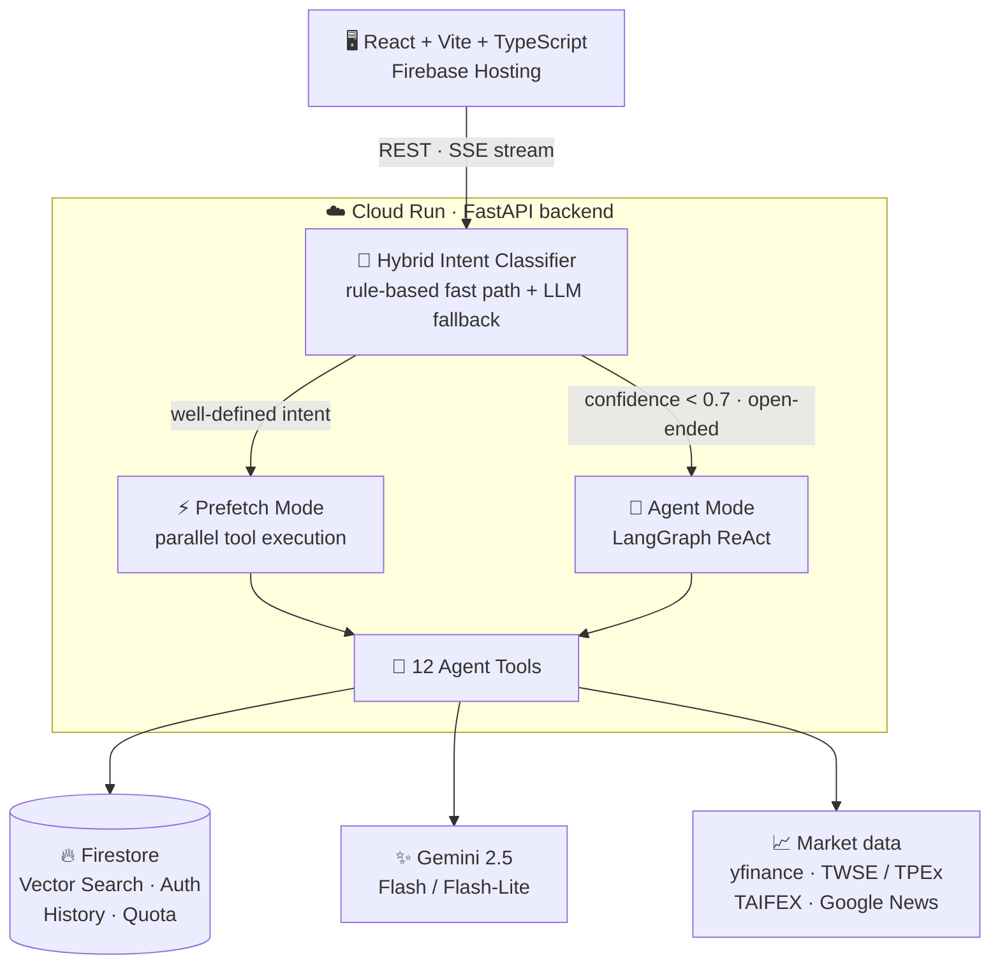
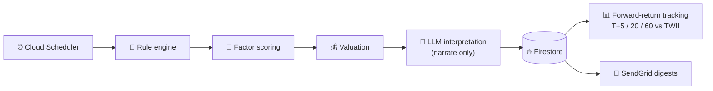

# 🧚 Navi — AI-Powered Stock Analyzer

_Named after Navi, the fairy guide in **The Legend of Zelda: Ocarina of Time** — a small companion that points you toward what matters._

**A full-stack LLM-agent stock-analysis assistant for the Taiwan market.** Ask a question in natural language; a hybrid intent classifier routes it either to a low-latency parallel-tool path or to an autonomous LangGraph ReAct agent, grounds the answer in a RAG knowledge base and live market data, and streams it back over SSE.

<p>
  <a href="https://github.com/dddenrose/Navi/actions/workflows/ci.yml"></a>
  
  
  
  
  
</p>

### 🔗 [Live Demo](https://navi-stock-analyzer.web.app) — no sign-up needed, click _"以訪客身分體驗"_ (guest mode) &nbsp;·&nbsp; [繁體中文 README](README.zh-TW.md)


> ⚠️ **Disclaimer** — For learning and research only. All analysis is generated by software and **does not constitute investment advice**. Invest at your own risk.

---

## What it does

- **Chat** — ask about any TW stock in natural language; answers combine technicals, fundamentals, institutional flows, margin data, news, and your own portfolio
- **Screener** — a scheduled pipeline that surfaces `value` and `momentum` picks per industry, then tracks how those picks actually performed
- **Portfolio** — holdings and transactions with real-time P/L, Taiwan-market fees (0.1425%, min NT$20) and sell-side tax (0.3%) on an average-cost basis
- **Stock pages** — price/RSI charts, fundamentals, chips, and news per ticker
- **Admin console** — user tiers, daily quotas, feature flags, usage summaries, audit logs

---

## Design decisions

The parts worth reading the code for.

**1 · The LLM never picks stocks.**
The screener is a deterministic pipeline — rule engine filters, factor model scores, valuation ranks — and only then does an LLM translate the resulting numbers into readable analysis. Every pick is reproducible and auditable rather than a black box. Picks are tracked forward at T+5/20/60 against the TWII benchmark with no survivorship or look-ahead bias, so the system can be proven wrong.

**2 · Two dispatch paths, chosen by a classifier, not by the agent.**
A hybrid intent classifier (rule-based fast path, LLM fallback, 10 categories with confidence scoring) decides how each question is answered. Well-defined intents skip the agent loop entirely and run their tools in parallel — lower latency, more consistent output. Only open-ended or low-confidence questions pay for autonomous ReAct reasoning.

**3 · Answers are grounded, not improvised.**
24 curated Markdown documents across 8 categories live in Firestore Vector Search. In the parallel path the knowledge base is queried automatically and a structured Chain-of-Thought prompt requires the answer to reason from it; in agent mode `search_knowledge` is just another tool the agent can reach for.

**4 · Backtests disclose their assumptions.**
Fees, taxes, slippage, and next-open fills (to avoid look-ahead bias) are all stated in the output. Backtesting is exposed *only* as an agent tool with no standalone page, which forces the LLM to interpret the metrics against the knowledge base instead of handing back a bare table of numbers.

**5 · Cost control is architectural.**
Per-user daily quotas, tier-based feature gating, and tier-based model selection (Flash-Lite for free users, Flash for paid) are enforced in the backend and configurable from the admin console — not bolted on after the bill arrives.

---

## Architecture



The 12 agent tools cover quotes, technicals, fundamentals, institutional and margin data, market-wide flows and futures positioning, news, portfolio, knowledge search, and backtesting — see [`docs/API.md`](docs/API.md#agent-tools) for the full list.

Alongside the request-driven chat path, a **scheduled screener pipeline** runs independently (Cloud Scheduler → Cloud Run):



---

## Tech stack

- **Backend** — Python 3.12 · FastAPI · LangChain 1.x + LangGraph · Gemini 2.5 Flash / Flash-Lite (Vertex AI) · text-embedding-004 · Firestore Vector Search
- **Frontend** — React 19 + TypeScript · Vite 7 · Tailwind CSS 4 · Zustand · Recharts · Firebase Auth
- **Infrastructure** — Cloud Run (asia-east1) · Firebase Hosting · Cloud Build · Cloud Scheduler · Firestore · SendGrid · Docker
- **Market data** — yfinance · TWSE / TPEx · TAIFEX · Google News RSS

---

## Getting started

```bash
# Backend
cd backend
uv sync
cp .env.example .env             # fill in GOOGLE_CLOUD_PROJECT etc.
uv run python cli.py ingest      # load the knowledge base into Firestore
uv run uvicorn main:app --reload --port 8000

# Frontend
cd frontend && npm install && npm run dev

# Tests
cd backend && uv run pytest tests/
```

Requires Python 3.12+ ([uv](https://docs.astral.sh/uv/)), Node 20+, and a Google Cloud project with Firestore + Vertex AI enabled. Full setup, environment variables, and project layout: [`docs/DEVELOPMENT.md`](docs/DEVELOPMENT.md).

---

## Documentation

| Document                                                   | Contents                                                                     |
| ---------------------------------------------------------- | ---------------------------------------------------------------------------- |
| [`docs/SCREENER_ARCHITECTURE.md`](docs/SCREENER_ARCHITECTURE.md) 🇹🇼   | Screener architecture, data flow, and the rule-engine-first rationale        |
| [`docs/MOMENTUM_BACKTEST_NOTES.md`](docs/MOMENTUM_BACKTEST_NOTES.md) 🇹🇼 | Momentum research, and the audit that invalidated my own earlier backtest |
| [`docs/DESIGN_NOTES.md`](docs/DESIGN_NOTES.md) 🇹🇼           | Tech-selection rationale, decisions I reversed mid-project, known limitations |
| [`docs/DEVELOPMENT.md`](docs/DEVELOPMENT.md)               | Setup, environment variables, project structure, deployment                  |
| [`docs/API.md`](docs/API.md)                               | REST endpoints and agent tools                                               |
| [`CHANGELOG.md`](CHANGELOG.md)                             | Version history                                                              |

🇹🇼 = written in Traditional Chinese.

---

## License

This project is for personal learning and portfolio demonstration purposes.
