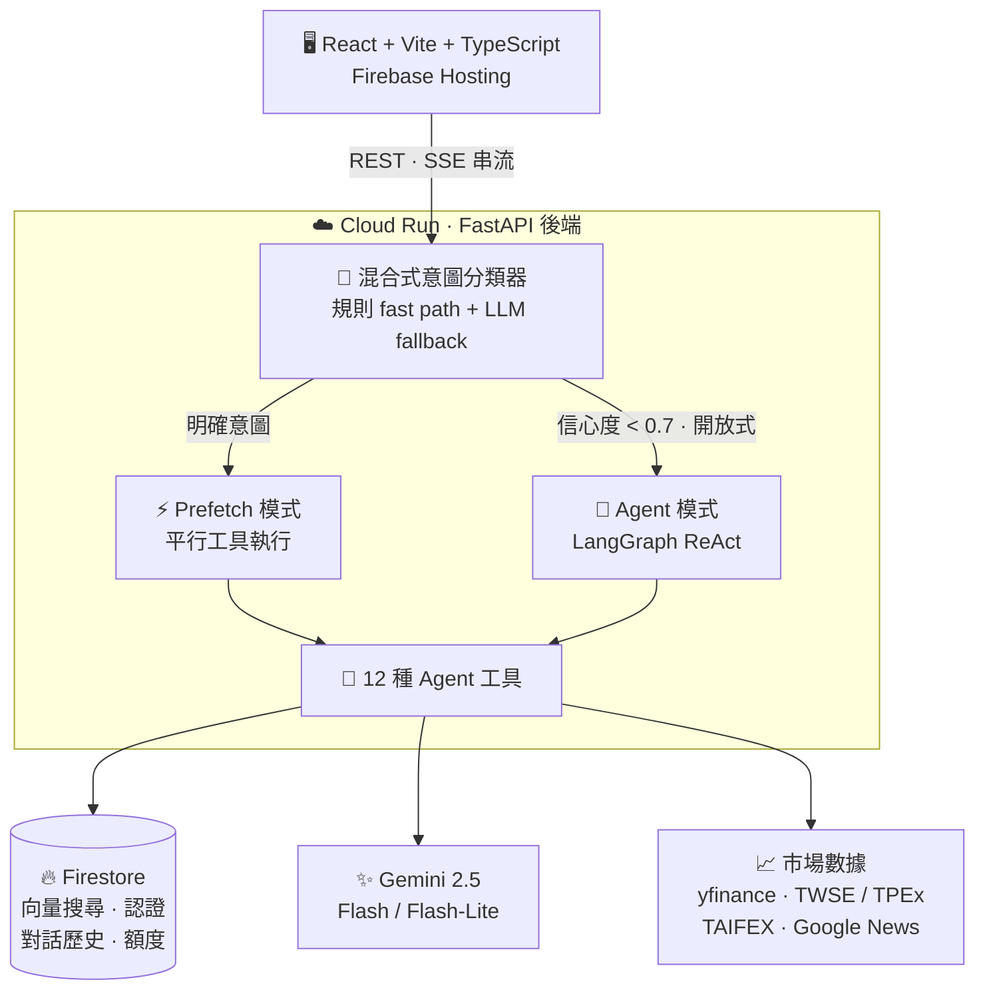
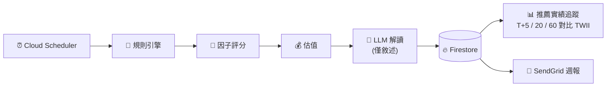

# 🧚 Navi — AI 智能股票分析助手

_名稱取自《薩爾達傳說：時之笛》中的精靈嚮導 Navi —— 一位為你指出關鍵所在的小夥伴。_

**Navi 是一套面向台股的全端 LLM Agent 股票分析助手。** 每個自然語言問題會由**混合式意圖分類器**在低延遲的**平行工具 Prefetch** 路徑與自主的 **LangGraph ReAct Agent**（12 種工具）之間路由 —— 每個回答都以 RAG 知識庫與即時市場數據接地，透過 SSE 串流即時回傳瀏覽器。另有一套**確定性量化選股器**以明確的規則引擎排序選股；LLM 只負責_解讀_數字，從不決定選股。

<p>
  
  
  
  
  
  
  
  
</p>

### 🔗 [線上 Demo](https://navi-stock-analyzer.web.app) — 免註冊，點「以訪客身分體驗」即可 &nbsp;·&nbsp; [English README](README.md)


> ⚠️ **免責聲明** — 僅供學習與研究之用。所有分析皆由軟體生成，**不構成投資建議**。投資有風險，決策請自行判斷。

---

## ✨ 功能特色

- **AI 對話分析** — 自然語言提問，混合式意圖分類器自動路由至最佳回應模式（Prefetch 平行工具 或 LangGraph ReAct Agent 自主決策），結合 RAG 知識庫與即時數據，透過 SSE Streaming 產出分析
- **混合式意圖分類** — 規則 fast path + LLM fallback 兩階段分類器，10 種意圖類別與信心度評分；低信心度自動 fallback 至完整 Agent 模式
- **AI 智能選股 Screener** — 定時多階段管線（規則引擎 → 因子評分 → 估值 → AI 解讀），依產業產出 `value`（價值）與 `momentum`（動能）推薦。AI 不黑箱決定選股：由確定性規則引擎先完成篩選、估值與排序，AI 僅負責把數字翻譯成投資人看得懂的文字。含**推薦實績追蹤**（T+5/20/60 報酬對比 TWII，無倖存者偏差與 look-ahead）與選配的 **Email 週報**
- **精選投資知識庫** — 24 份 Markdown 文件跨 8 大分類（技術分析 / 基本分析 / 投資理論 / 台股市場 / 總體帶註 / 代理人格 / 免責合規 / 工具判讀），進場分析與全面分析時自動引用 KB 內容
- **中文股票名稱解析** — 動態串接 TWSE + TPEx API，支援中文名稱 → 代碼查詢（~2,400 檔股票，24 小時快取）
- **技術面分析** — RSI、MACD、KD、均線、布林通道、費波那契回撤、5 源支撐壓力位（均線、布林、波段高低點、Fibonacci、心理關卡），以及自動計算停損與風險報酬比
- **基本面分析** — PE、PB、ROE、EPS、營收成長，以及 3 層級公平價位估算（便宜價/合理價/昂貴價，基於 PE 百分位 × EPS）
- **籌碼面分析** — 三大法人（外資、投信、自營商）買賣超追蹤，以及融資融券數據（餘額、使用率、資券互抵）
- **總經 / 大盤分析** — 全市場指標：大盤指數報價、三大法人整體買賣超彙總、TAIFEX 期貨未平倉多空部位
- **財經新聞** — Google News RSS 即時財經新聞搜尋
- **投資組合追蹤** — 記錄持股與交易，即時計算市值、持股佔比與**已實現損益**；買賣自動以平均成本法計算台股手續費（0.1425%、最低 NT$20）與賣出證交稅（0.3%），AI 可直接查詢你的持倉狀態
- **策略回測** — 支援均線交叉、RSI、MACD 及自訂條件策略；完整績效報告（報酬率、夏普比率、最大回撤、勝率），並揭露成交假設（費稅、還原股價）
- **使用者分層、額度與功能權限** — 每位使用者每日訊息額度，並依 tier（free / pro / unlimited / admin）控管功能存取；LLM 模型依 tier 選擇以控制成本（免費層用 Flash-Lite、付費層用 Flash）
- **後台管理主控台** — Web 後台管理使用者、額度設定、功能開關、用量統計與稽核日誌
- **對話歷史** — 多輪對話以使用者為單位持久化至 Firestore，支援歷史訊息載入

---

## 🏗️ 系統架構



除了請求驅動的對話流程外，另有一條**定時 Screener 管線**獨立運行
（Cloud Scheduler → Cloud Run）：規則引擎 → 因子評分 → 估值 → AI 解讀 →
Firestore，並含推薦實績追蹤與選配的 SendGrid Email 週報寄送。



### 雙模式分派

**混合式意圖分類器**（規則 fast path + LLM fallback）分析每個使用者問題（10 種類別、附信心度），路由至兩種模式之一：

- **Prefetch 模式** — 針對明確意圖（例如：進場分析、全面分析）：平行呼叫所需工具（含自動知識庫查詢），再以結構化 Chain-of-Thought 提示彙整結果，並強制要求引用 KB 內容，延遲更低、品質更一致
- **Agent 模式** — 針對開放式或低信心度的問題：由 LangGraph `create_react_agent` 自主決定呼叫 12 種工具中哪些（含 `search_knowledge`），彈性更高

### 12 種 Agent 工具

| 工具                             | 說明                                                            |
| -------------------------------- | --------------------------------------------------------------- |
| `get_stock_price`                | 即時股價、漲跌幅、成交量、市值                                  |
| `analyze_technicals`             | MA、RSI、MACD、KD、布林通道、Fibonacci 回撤、支撐壓力、停損建議 |
| `analyze_fundamentals`           | PE、PB、ROE、EPS、成長率、3 層級公平價位（便宜/合理/昂貴）      |
| `search_knowledge`               | 對 **24 份投資知識文件（8 大分類）**進行 RAG 向量搜尋（取 top-5）          |
| `get_institutional`              | 外資、投信、自營商買賣超數據（TWSE/OTC API）                    |
| `get_margin_trading`             | 融資融券餘額、使用率、資券互抵                                  |
| `search_financial_news`          | Google News RSS 財經新聞搜尋                                    |
| `get_portfolio`                  | 使用者投資組合（含即時損益與持股佔比分析）                      |
| `run_strategy_backtest`          | 均線交叉 / RSI / MACD / 自訂條件策略回測                        |
| `get_market_overview`            | 台股大盤指數報價（盤中即時 / 盤後收盤）                         |
| `get_market_institutional_flows` | 全市場三大法人（外資 / 投信 / 自營商）買賣超彙總                |
| `get_market_futures_positions`   | TAIFEX 台指期未平倉多空部位（TXF / MXF / TMF）                  |

---

## 🛠️ 技術棧

### 後端

| 類別      | 技術                                      |
| --------- | ----------------------------------------- |
| 語言      | Python 3.12                               |
| Web 框架  | FastAPI 0.115+                            |
| AI 框架   | LangChain 1.x + LangGraph（ReAct Agent） |
| LLM       | Gemini 2.5 Flash / Flash-Lite（透過 Vertex AI） |
| Embedding | text-embedding-004（768 維向量）          |
| Vector DB | Firestore Vector Search                   |
| 資料來源  | yfinance · TWSE/OTC API · Google News RSS |

### 前端

| 類別     | 技術                    |
| -------- | ----------------------- |
| 框架     | React 19 + TypeScript   |
| 建構工具 | Vite 7                  |
| 樣式     | Tailwind CSS 4          |
| 圖表     | Recharts                |
| 路由     | React Router DOM 7      |
| 狀態管理 | Zustand                 |
| 認證     | Firebase Authentication |

### 基礎設施

| 類別     | 技術                              |
| -------- | --------------------------------- |
| 後端部署 | Google Cloud Run（asia-east1）    |
| 前端部署 | Firebase Hosting（CDN + headers） |
| CI/CD    | Google Cloud Build                |
| 資料庫   | Firestore                         |
| 排程     | Google Cloud Scheduler（screener run / track / notify） |
| Email    | SendGrid（screener 週報）         |
| 容器化   | Docker                            |

---

## 📡 API 端點

`認證`欄位：✓ = Firebase JWT · **Admin** = 管理員角色 · **Token** = Cloud Scheduler 共享密鑰 · ✗ = 公開。

### 對話 Chat

| 路徑                                    | 方法   | 說明                | 認證 |
| --------------------------------------- | ------ | ------------------- | ---- |
| `/api/chat`                             | POST   | SSE 串流對話        | ✓    |
| `/api/chat/quota`                       | GET    | 目前使用者今日額度狀態 | ✓  |
| `/api/chat/conversations`               | GET    | 列出使用者對話      | ✓    |
| `/api/chat/conversations/{id}/messages` | GET    | 取得對話歷史訊息    | ✓    |
| `/api/chat/conversations/{id}`          | DELETE | 刪除對話            | ✓    |

### 股票 Stock

| 路徑                                | 方法 | 說明                   | 認證 |
| ----------------------------------- | ---- | ---------------------- | ---- |
| `/api/stock/search`                 | GET  | 搜尋台股代碼 / 名稱    | ✓    |
| `/api/stock/{ticker}`               | GET  | 股票概覽（價格、漲跌） | ✓    |
| `/api/stock/{ticker}/technical`     | GET  | 技術指標分析           | ✓    |
| `/api/stock/{ticker}/fundamental`   | GET  | 基本面分析 + 公平價    | ✓    |
| `/api/stock/{ticker}/institutional` | GET  | 三大法人買賣超（近 N 日） | ✓ |
| `/api/stock/{ticker}/margin`        | GET  | 融資融券（近 N 日）    | ✓    |

### 投資組合 Portfolio

| 路徑                                    | 方法       | 說明                       | 認證 |
| --------------------------------------- | ---------- | -------------------------- | ---- |
| `/api/portfolio`                        | GET        | 投資組合（含即時損益）     | ✓    |
| `/api/portfolio/holdings`               | GET/POST   | 查看 / 新增持股            | ✓    |
| `/api/portfolio/holdings/{id}`          | PUT/DELETE | 修改 / 刪除持股            | ✓    |
| `/api/portfolio/transactions`           | GET/POST   | 查看 / 記錄買賣交易（含費稅） | ✓ |
| `/api/portfolio/transactions/estimate`  | GET        | 試算交易費用 / 稅          | ✓    |

### 回測與知識庫

| 路徑                       | 方法 | 說明                    | 認證 |
| -------------------------- | ---- | ----------------------- | ---- |
| `/api/backtest`            | POST | 執行策略回測（額度 + 限流） | ✓ |
| `/api/backtest/strategies` | GET  | 列出可用策略            | ✓    |
| `/api/knowledge/stats`     | GET  | 知識庫統計              | ✓    |

### 智能選股 Screener

| 路徑                                        | 方法    | 說明                        | 認證  |
| ------------------------------------------- | ------- | --------------------------- | ----- |
| `/api/screener/run`                         | POST    | 觸發一次選股（Stage 1→2→3） | Token |
| `/api/screener/reports`                     | GET     | 列出最近報告                | ✓     |
| `/api/screener/reports/latest`              | GET     | 某 profile 的最新報告       | ✓     |
| `/api/screener/reports/{id}`                | GET     | 報告詳情（依產業分組 picks）| ✓     |
| `/api/screener/reports/{id}/picks/{ticker}` | GET     | 單一 pick 詳情              | ✓     |
| `/api/screener/track`                       | POST    | 更新推薦實績追蹤            | Token |
| `/api/screener/tracking/summary`            | GET     | 推薦實績統計（勝率、超額）  | ✓     |
| `/api/screener/subscriptions`               | GET/PUT | 取得 / 更新 Email 訂閱      | ✓     |
| `/api/screener/notify`                      | POST    | 將最新報告寄給訂閱者        | Token |
| `/api/screener/unsubscribe`                 | GET     | 一鍵退訂（HMAC token）      | ✗     |

### 功能權限與後台

| 路徑                                        | 方法    | 說明                    | 認證  |
| ------------------------------------------- | ------- | ----------------------- | ----- |
| `/api/features/access`                      | GET     | 使用者的有效功能存取權  | ✓     |
| `/api/admin/me`                             | GET     | 目前管理員身分          | Admin |
| `/api/admin/users`                          | GET     | 列出使用者              | Admin |
| `/api/admin/users/{uid}`                    | GET/PATCH | 取得 / 更新使用者（tier、狀態） | Admin |
| `/api/admin/quota-configs`                  | GET     | 列出額度設定            | Admin |
| `/api/admin/quota-configs/{tier}`           | PUT     | 更新某 tier 額度        | Admin |
| `/api/admin/feature-access-configs`         | GET     | 列出功能存取設定        | Admin |
| `/api/admin/feature-access-configs/{key}`   | PUT     | 更新某功能存取規則      | Admin |
| `/api/admin/usage/summary`                  | GET     | 用量彙總                | Admin |
| `/api/admin/logs`                           | GET     | 稽核 / 請求日誌         | Admin |

### 系統 System

| 路徑      | 方法 | 說明     | 認證 |
| --------- | ---- | -------- | ---- |
| `/health` | GET  | 健康檢查 | ✗    |

---

## 🚀 快速開始

### 前置需求

- **Python 3.12+** 與 [uv](https://docs.astral.sh/uv/) 套件管理工具
- **Node.js 20+** 與 npm
- **Google Cloud 專案**（已啟用 Firestore、Vertex AI）
- **Firebase 專案**（已啟用 Authentication）
- **Service Account JSON**（具備 Firestore 與 Vertex AI 權限）

### 後端

```bash
cd backend

# 安裝依賴
uv sync

# 設定環境變數
cp .env.example .env
# 編輯 .env，填入你的 Google Cloud Project ID 等設定

# 放入 Service Account 金鑰
mkdir -p .secrets
cp /path/to/your/service-account.json .secrets/service-account.json

# 匯入知識庫文件到 Firestore
uv run python cli.py ingest

# 啟動開發伺服器
uv run uvicorn main:app --reload --port 8000
```

### 前端

```bash
cd frontend

# 安裝依賴
npm install

# 設定 Firebase（在 src/lib/firebase.ts 填入你的 Firebase config）

# 啟動開發伺服器
npm run dev
```

### Docker（一鍵啟動後端）

```bash
docker compose up --build
```

### 執行測試

```bash
cd backend
uv sync                    # 安裝依賴（含開發工具）
uv run pytest tests/       # 執行所有測試
uv run pytest tests/test_stock_service.py -v  # 執行特定測試檔案
```

### 環境變數

| 變數                             | 說明                        | 預設值               |
| -------------------------------- | --------------------------- | -------------------- |
| `GOOGLE_CLOUD_PROJECT`           | Google Cloud 專案 ID        | —                    |
| `GOOGLE_APPLICATION_CREDENTIALS` | Service Account JSON 路徑   | —                    |
| `GEMINI_MODEL_NAME`              | 付費層（pro/unlimited/admin）LLM 模型 | `gemini-2.5-flash`   |
| `GEMINI_MODEL_NAME_FREE`         | 免費層 LLM 模型             | `gemini-2.5-flash-lite` |
| `EMBEDDING_MODEL_NAME`           | Embedding 模型              | `text-embedding-004` |
| `AUTH_REQUIRED`                  | 是否啟用 JWT 驗證           | `true`               |
| `CORS_ORIGINS`                   | 允許的跨域來源（逗號分隔）  | —                    |
| `DEBUG`                          | 除錯模式（開啟 Swagger UI） | `false`              |
| `TW_QUOTE_PROVIDER`              | 台股報價來源：`mis`（即時）或 `openapi`（T-1 收盤） | `mis` |
| `SCREENER_LLM_MODEL`             | Screener Stage 3 解讀層模型 | `gemini-2.5-flash-lite` |
| `SCREENER_RUNNER_TOKEN`          | Scheduler 觸發 screener 端點的共享密鑰 | —         |
| `SCREENER_UNSUBSCRIBE_SECRET`    | 一鍵退訂連結的 HMAC 密鑰    | —                    |
| `SCREENER_PUBLIC_BASE_URL`       | Email 連結使用的公開 base URL | `https://navi-stock-analyzer.web.app` |
| `SENDGRID_API_KEY`              | SendGrid 金鑰（screener Email 週報，選配） | —          |
| `EMAIL_FROM_ADDRESS`             | 週報寄件者地址              | `notify@navi-stock.app` |
| `EMAIL_FROM_NAME`                | 週報寄件者顯示名稱          | `Navi 智能選股`      |

---

## 📁 專案結構

```
navi/
├── backend/
│   ├── main.py                  # FastAPI 入口
│   ├── config.py                # 環境變數管理 + 依 tier 選模型（pydantic-settings）
│   ├── cli.py                   # CLI 工具（知識庫匯入等）
│   ├── api/routes/              # API 路由
│   │   ├── chat.py              #   AI 對話（SSE Streaming）+ 額度
│   │   ├── stock.py             #   股票數據與分析（搜尋、技術、基本、籌碼）
│   │   ├── portfolio.py         #   投資組合 + 交易（費稅、已實現損益）
│   │   ├── backtest.py          #   策略回測
│   │   ├── screener.py          #   AI 選股：run / reports / tracking / subscriptions
│   │   ├── features.py          #   功能存取探索
│   │   ├── admin.py             #   後台管理 API（使用者、額度、開關、日誌）
│   │   └── knowledge.py         #   知識庫管理
│   ├── services/                # 業務邏輯層
│   │   ├── agent_service.py     #   LangGraph ReAct + 混合意圖分類 + Prefetch
│   │   ├── conversation_service.py # 多輪對話歷史（Firestore）
│   │   ├── stock_service.py     #   股票數據（yfinance）+ 代碼解析
│   │   ├── embedding_service.py #   Embedding 處理
│   │   ├── backtest_service.py  #   回測引擎
│   │   ├── institutional_service.py # TWSE/OTC 法人數據
│   │   ├── margin_service.py    #   融資融券數據
│   │   ├── macro_service.py     #   大盤指數 / 法人資金流 / 期貨部位
│   │   ├── news_service.py      #   Google News RSS
│   │   ├── portfolio_service.py #   投資組合管理
│   │   ├── quota_service.py     #   每位使用者每日額度計數
│   │   ├── feature_access_service.py # 依 tier 的功能權限控管
│   │   ├── twse_parsers.py      #   共用 TWSE 欄位解析層（T86 / MI_MARGN）
│   │   ├── screener/            #   選股管線（規則、評分、估值、AI、Email、追蹤）
│   │   └── firestore_client.py  #   Firestore Client 單例
│   ├── tools/                   # LangChain / LangGraph Agent Tools（12 種）
│   ├── models/                  # Pydantic Schemas（schemas.py）
│   ├── knowledge_base/          # 精選知識文件（24 份 Markdown、8 大分類）
│   │   ├── technical_analysis/  #   RSI、MACD、KD、MA、布林、量能、K 線、支撐壓力
│   │   ├── fundamental_analysis/#   財務比率、財報解讀、估值方法、產業分析
│   │   ├── investment_theory/   #   風險管理、資產配置、行為金融、ETF
│   │   ├── taiwan_market/       #   台股市場交易機制與資料來源
│   │   ├── macro/               #   總體指標（利率、匯率、景氣循環）
│   │   ├── agent_persona/       #   代理人投資哲學與回覆風格
│   │   ├── compliance/          #   免責聲明與風險提醒
│   │   └── tool_interpretation/ #   如何解讀回測 / 分析輸出
│   ├── data_pipeline/           # 知識庫匯入管線
│   ├── scripts/                 # 維運腳本（seed 設定、設定 admin/tier、本地跑選股）
│   └── tests/                   # Pytest 測試（services、screener、parsers、RAG、quota…）
├── frontend/
│   ├── src/
│   │   ├── pages/               # Dashboard、Chat、Stock（分頁）、Portfolio、Backtest、Screener、Login、admin/
│   │   ├── components/          # Layout、PriceChart、RsiChart、StatCard、QuotaBadge、FeatureGuard 等
│   │   ├── lib/                 # API Client（含 api/screener.ts）& Firebase 設定
│   │   └── store/               # Zustand（auth + theme + quota）
│   └── firebase.json            # Firebase Hosting 設定（rewrites、headers、cache）
├── docker-compose.yml           # 本地開發容器
├── cloudbuild.yaml              # Cloud Build → Cloud Run 部署
├── cloudbuild-ingest.yaml       # Cloud Build → 知識庫匯入
├── cloudbuild-test.yaml         # Cloud Build → 測試管線
├── scripts/
│   ├── deploy.sh                # 手動部署腳本（Artifact Registry → Cloud Run）
│   ├── setup_screener_scheduler.sh # Cloud Scheduler 排程（run / track / notify）
│   └── setup_trigger.sh         # Cloud Build 觸發器設定
├── PROPOSAL.md                  # 詳細專案企劃書
├── PROPOSAL-quota.md            # 額度與功能權限設計
├── SCREENER_PROPOSAL.md         # 智能選股產品企劃
├── SCREENER_ARCHITECTURE.md     # 選股系統架構與資料流
├── MOMENTUM_BACKTEST_NOTES.md   # 動能策略研究與回測稽核筆記
└── CHANGELOG.md                 # 版本變更記錄
```

---

## 📚 延伸文件

| 文件                        | 內容                                        |
| --------------------------- | ------------------------------------------- |
| `PROPOSAL.md`               | 整體專案企劃書                              |
| `PROPOSAL-quota.md`         | 依 tier 的額度與功能權限控管設計            |
| `SCREENER_PROPOSAL.md`      | AI 智能選股產品企劃                         |
| `SCREENER_ARCHITECTURE.md`  | 選股系統架構、資料流與「規則引擎優先」設計理念 |
| `MOMENTUM_BACKTEST_NOTES.md`| 動能策略討論 + 可重現的回測稽核             |
| `CHANGELOG.md`              | 版本變更記錄                                |

---

## 📄 License

This project is for personal learning and portfolio demonstration purposes.
