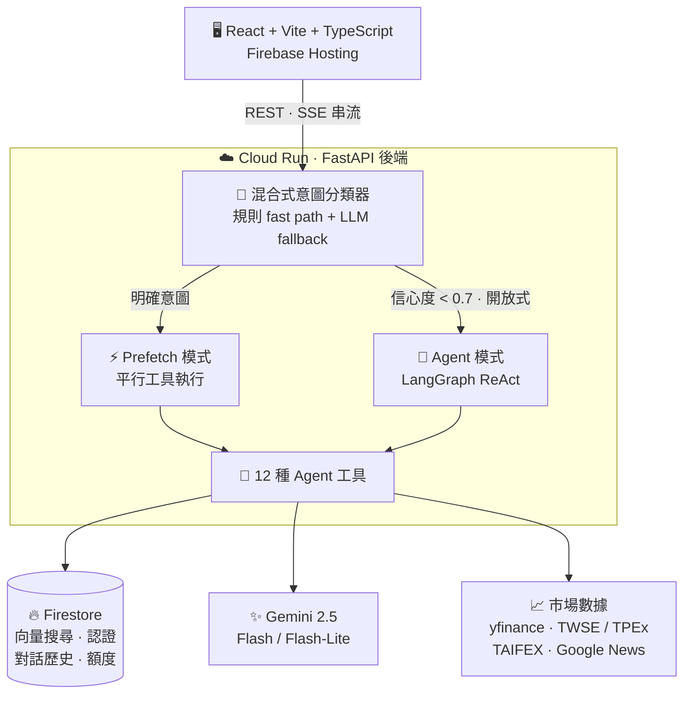
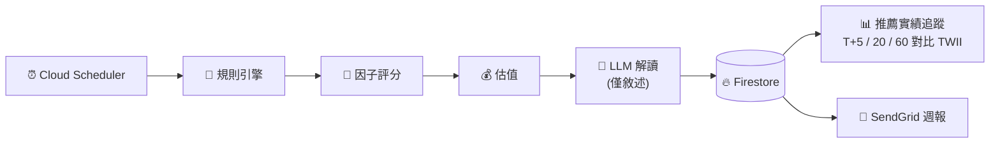

# 🧚 Navi — AI 智能股票分析助手

_名稱取自《薩爾達傳說：時之笛》中的精靈嚮導 Navi —— 一位為你指出關鍵所在的小夥伴。_

**一套面向台股的全端 LLM Agent 股票分析助手。** 用自然語言提問，由混合式意圖分類器決定走低延遲的平行工具路徑、還是交給自主的 LangGraph ReAct Agent；答案以 RAG 知識庫與即時市場數據接地，透過 SSE 串流回傳瀏覽器。

<p>
  <a href="https://github.com/dddenrose/Navi/actions/workflows/ci.yml"></a>
  
  
  
  
  
</p>

### 🔗 [線上 Demo](https://navi-stock-analyzer.web.app) — 免註冊，點「以訪客身分體驗」即可 &nbsp;·&nbsp; [English README](README.md)


> ⚠️ **免責聲明** — 僅供學習與研究之用。所有分析皆由軟體生成，**不構成投資建議**。投資有風險，決策請自行判斷。

---

## 這個專案做什麼

- **對話分析** — 用自然語言問任何台股標的，回答整合技術面、基本面、法人籌碼、融資融券、新聞，以及你自己的持倉
- **智能選股** — 定時管線依產業產出 `value`（價值）與 `momentum`（動能）推薦，並持續追蹤這些推薦後來的真實表現
- **投資組合** — 持股與交易紀錄、即時損益，買賣以平均成本法計算台股手續費（0.1425%、最低 NT$20）與賣出證交稅（0.3%）
- **個股頁面** — 每檔標的的價格 / RSI 圖表、基本面、籌碼、新聞
- **後台主控台** — 使用者分層、每日額度、功能開關、用量統計、稽核日誌

---

## 關鍵設計決策

真正值得翻程式碼的部分。

**1 · LLM 不決定選誰。**
選股是一條確定性管線 —— 規則引擎篩選、因子模型評分、估值排序 —— 全部跑完之後，LLM 才登場把數字翻譯成看得懂的文字。每一檔推薦都可重現、可稽核，而不是黑箱。推薦會被持續追蹤到 T+5/20/60 並對比 TWII 基準，且無倖存者偏差與 look-ahead，因此這套系統是**可以被證明錯**的。

**2 · 兩條分派路徑，由分類器決定，不是由 Agent 決定。**
混合式意圖分類器（規則 fast path + LLM fallback，10 種類別附信心度）先決定這個問題該怎麼答。明確意圖直接跳過 agent 迴圈、平行呼叫所需工具 —— 延遲更低、輸出更一致；只有開放式或低信心度的問題才需要付出自主 ReAct 推理的成本。

**3 · 回答是接地的，不是掰的。**
24 份精選 Markdown 文件、8 大分類，存放在 Firestore Vector Search。平行路徑會自動查詢知識庫，並以結構化 Chain-of-Thought 提示強制要求「根據知識庫推理」；Agent 模式下 `search_knowledge` 則是 Agent 可自行取用的工具之一。

**4 · 回測揭露自己的假設。**
費用、稅金、滑價，以及「以次一交易日開盤價成交」（消除 look-ahead bias）全部寫在輸出裡。回測**只**以 agent tool 形式提供、沒有獨立頁面，這會強迫 LLM 搭配知識庫解讀績效，而不是丟一張裸的數字表給使用者。

**5 · 成本控制寫在架構裡。**
每位使用者每日額度、依 tier 的功能權限、依 tier 的模型選擇（免費層 Flash-Lite、付費層 Flash）都在後端強制執行，並可從後台調整 —— 不是等帳單來了才補。

---

## 系統架構



12 種 Agent 工具涵蓋報價、技術面、基本面、法人與融資券、全市場資金流與期貨部位、新聞、投資組合、知識庫搜尋與策略回測 —— 完整清單見 [`docs/API.md`](docs/API.md#agent-tools)。

除了請求驅動的對話流程外，另有一條**定時選股管線**獨立運行（Cloud Scheduler → Cloud Run）：



---

## 技術棧

- **後端** — Python 3.12 · FastAPI · LangChain 1.x + LangGraph · Gemini 2.5 Flash / Flash-Lite（Vertex AI）· text-embedding-004 · Firestore Vector Search
- **前端** — React 19 + TypeScript · Vite 7 · Tailwind CSS 4 · Zustand · Recharts · Firebase Auth
- **基礎設施** — Cloud Run（asia-east1）· Firebase Hosting · Cloud Build · Cloud Scheduler · Firestore · SendGrid · Docker
- **市場數據** — yfinance · TWSE / TPEx · TAIFEX · Google News RSS

---

## 快速開始

```bash
# 後端
cd backend
uv sync
cp .env.example .env             # 填入 GOOGLE_CLOUD_PROJECT 等設定
uv run python cli.py ingest      # 匯入知識庫到 Firestore
uv run uvicorn main:app --reload --port 8000

# 前端
cd frontend && npm install && npm run dev

# 測試
cd backend && uv run pytest tests/
```

需要 Python 3.12+（[uv](https://docs.astral.sh/uv/)）、Node 20+，以及一個已啟用 Firestore + Vertex AI 的 Google Cloud 專案。完整安裝步驟、環境變數與專案結構請見 [`docs/DEVELOPMENT.md`](docs/DEVELOPMENT.md)（英文）。

---

## 延伸文件

| 文件                                                       | 內容                                             |
| ---------------------------------------------------------- | ------------------------------------------------ |
| [`SCREENER_ARCHITECTURE.md`](SCREENER_ARCHITECTURE.md)     | 選股系統架構、資料流與「規則引擎優先」設計理念   |
| [`MOMENTUM_BACKTEST_NOTES.md`](MOMENTUM_BACKTEST_NOTES.md) | 動能策略研究，以及我把自己舊回測數字判定失效的稽核 |
| [`docs/DESIGN-NOTES.md`](docs/DESIGN-NOTES.md)             | 技術選型理由、開發中推翻的決定、已知限制         |
| [`docs/DEVELOPMENT.md`](docs/DEVELOPMENT.md)               | 安裝設定、環境變數、專案結構、部署流程（英文）   |
| [`docs/API.md`](docs/API.md)                               | REST 端點與 Agent 工具清單（英文）               |
| [`CHANGELOG.md`](CHANGELOG.md)                             | 版本變更記錄                                     |

---

## License

This project is for personal learning and portfolio demonstration purposes.
