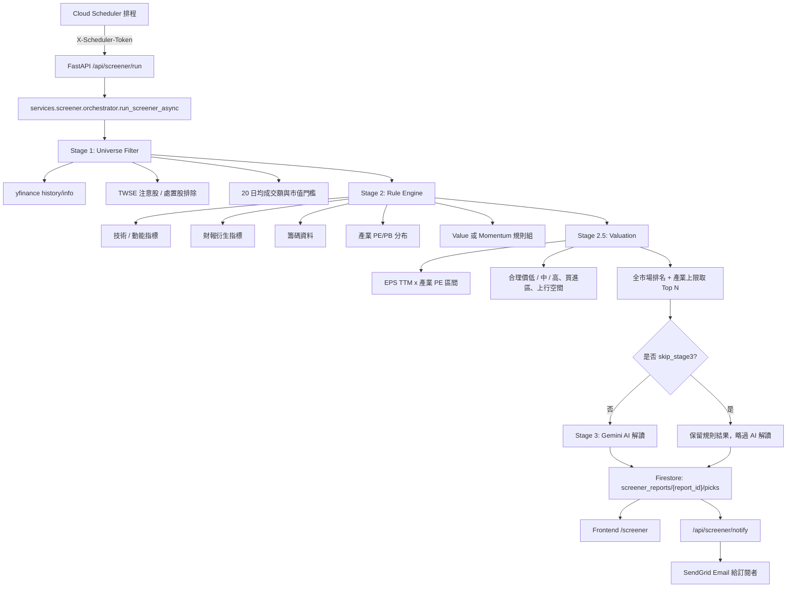
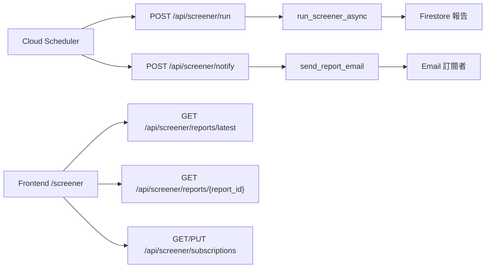
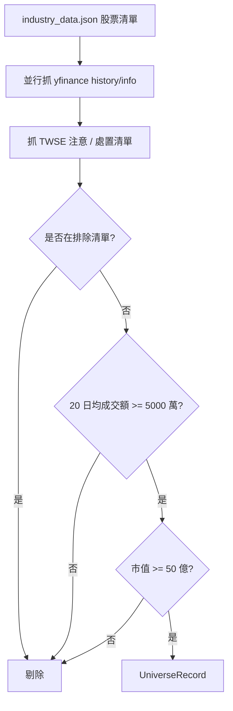
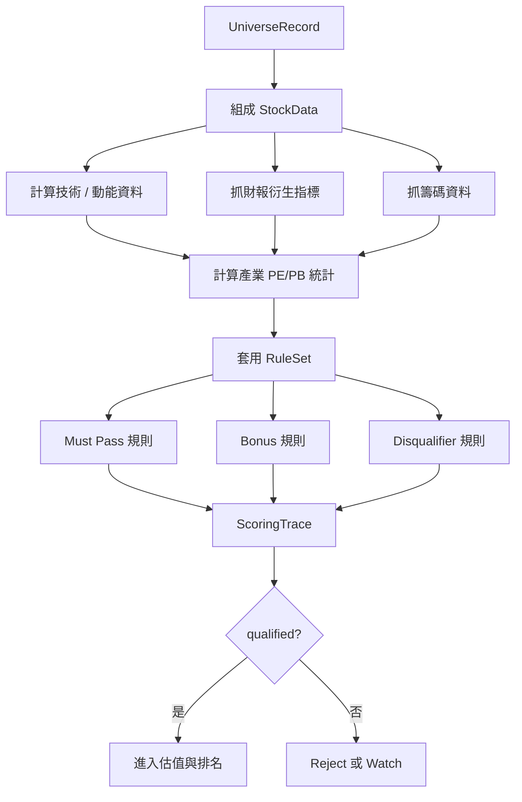
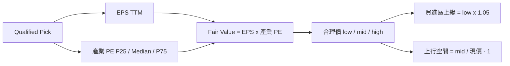
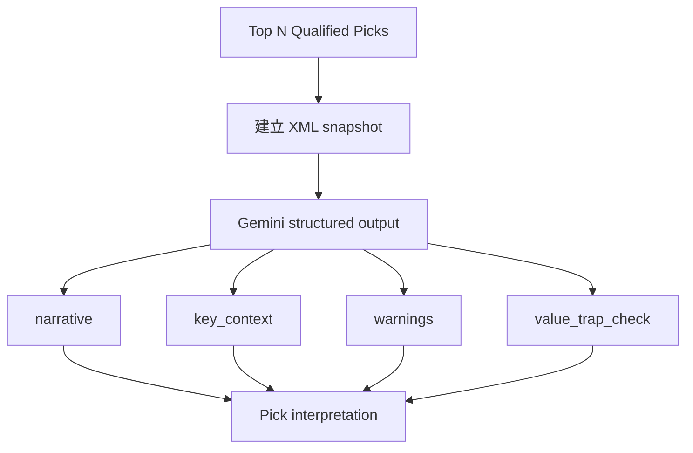
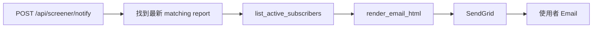

# Navi 智能選股架構說明

本文說明 Navi「智能選股 / Screener」功能的系統架構、資料流與實作細節。內容以目前程式碼實作為準，重點是：AI 不直接黑箱決定推薦股票，而是由規則引擎先完成篩選、估值與排序，再由 AI 負責把結果轉譯成投資人看得懂的分析文字。

## 1. 架構總覽



主要檔案：

- `backend/api/routes/screener.py`：Screener API 入口，包含觸發、查詢報告、查詢單檔 pick、Email 訂閱與通知。
- `backend/services/screener/orchestrator.py`：管線協調器，串接 Stage 1、Stage 2、Stage 3，並將結果寫入 Firestore。
- `backend/services/screener/universe.py`：Stage 1 股票池粗篩。
- `backend/services/screener/factor_scorer.py`：Stage 2 指標組裝、規則引擎執行、產業內排名。
- `backend/services/screener/rules.py`：Value / Momentum 兩套規則定義。
- `backend/services/screener/valuation.py`：規則化合理價計算。
- `backend/services/screener/ai_evaluator.py`：Stage 3 AI 解讀。
- `backend/services/screener/email_sender.py`：Email 報告渲染與寄送。
- `frontend/src/pages/Screener.tsx`：前端智能選股頁面。
- `frontend/src/lib/api/screener.ts`：前端 API client。

## 2. API 與排程入口



`POST /api/screener/run` 使用 `X-Scheduler-Token` shared-secret 保護，預期由 Cloud Scheduler 呼叫。Request body 會指定：

- `profile`：`momentum` 或 `value`。
- `frequency`：`daily` 或 `weekly`（排程上兩個 profile 都是週頻）。
- `total_picks`：全市場最終保留幾檔（預設 10）。
- `max_per_industry`：單一產業上限（預設 2）。
- `skip_stage3`：是否跳過 LLM 解讀，通常用於本機驗證或省成本測試。
- `enable_chips`：是否啟用籌碼資料。
- `tickers`：可選，限制本次只跑特定股票池。

排程腳本位於 `scripts/setup_screener_scheduler.sh`：兩個 profile 均為**週頻**（週日晚間 run、週一 07:00 notify），另有平日盤後的 track job 更新實績追蹤。設計理由：使用者的個股持有期為 3-6 個月，日頻報告對此持有期只是雜訊，且會讓追蹤統計的「推薦事件」被同一檔股票重複灌水。

## 3. Stage 1: Universe Filter

Stage 1 目標是用低成本規則把市場股票池縮小，只留下流動性與市值足夠、且沒有明顯交易異常的股票。



實作檔案：`backend/services/screener/universe.py`

預設門檻：

- `MIN_AVG_TURNOVER_TWD = 50_000_000`：20 日均成交額大於 5,000 萬台幣。
- `MIN_MARKET_CAP_TWD = 5_000_000_000`：市值大於 50 億台幣。
- `HISTORY_PERIOD = "8mo"`：抓 8 個月歷史資料，讓後續能計算 6 個月報酬、SMA120、相對強弱等指標。

輸出資料型別是 `UniverseRecord`，包含：

- `ticker`、`name`、`industry`
- `price`
- `market_cap`
- `avg_turnover_20d`
- `history`：下游 Stage 2 會重用，避免重抓股價。
- `info`：yfinance info，包含 PE、PB、EPS 等基礎欄位。

注意股 / 處置股資料來自 TWSE endpoint，實作上是 best-effort：如果 TWSE API 暫時失敗，不會阻塞整個選股流程。

### 3.1 產業分類（Navi-11）

TWSE 官方分類（28 類）太細，同類樣本數不足以算產業 PE 中位數；GICS（11 類）對台股又不夠貼切。
因此自建 **11 類**，由 `backend/scripts/seed_industry_mapping.py` 從
[TWSE ISIN 公開清單](https://isin.twse.com.tw/isin/C_public.jsp?strMode=2) 抓取後映射，
產出 `backend/services/screener/industry_data.json`。對照關係以 `NAVI_BUCKETS` 常數為準：

| Navi-11    | 對應 TWSE 類別關鍵字                       |
| ---------- | ------------------------------------------ |
| 半導體     | 半導體                                     |
| 電子零組件 | 電子零組件、光電、其他電子                 |
| 電腦及週邊 | 電腦及週邊 / 周邊、通信網路                |
| 電子製造   | 電子通路、資訊服務                         |
| 金融保險   | 金融、證券                                 |
| 傳產製造   | 鋼鐵、塑膠、化學、化工、橡膠、玻璃、紡織   |
| 航運汽車   | 航運、汽車                                 |
| 生技醫療   | 生技、醫療                                 |
| 民生消費   | 食品、貿易百貨、觀光、居家                 |
| 建材營造   | 建材、水泥                                 |
| 公用其他   | 公用、油電、其他（**未命中時的 fallback**） |

配對用「包含」而非完全相等，以容納 TWSE 的類別名稱變體（如「化學工業」與「化學生技醫療」）。

注意「公用其他」是異質 fallback 桶，其產業 PE 中位數無估值意義——落在該桶的股票估值一律回
`unavailable`（見 §5）。新增產業或 TWSE 改分類名稱時，改 `NAVI_BUCKETS` 後重跑 seed 腳本。

## 4. Stage 2: Rule Engine

Stage 2 是目前智能選股的核心。它不是舊 proposal 中的 z-score 加權打分，而是規則化、可追蹤、可向使用者解釋的 rule engine。



實作檔案：

- `backend/services/screener/factor_scorer.py`
- `backend/services/screener/rules.py`
- `backend/services/screener/fundamentals_fetcher.py`
- `backend/services/screener/chips_data.py`

### 4.1 StockData 組裝

`factor_scorer.evaluate_universe()` 會把 Stage 1 的 `UniverseRecord` 轉成規則引擎使用的 `StockData`。

技術與動能指標包含：

- 3 個月報酬：`return_3m`
- 6 個月報酬：`return_6m`
- 6 個月相對大盤強弱：`rel_strength_6m`
- SMA60 / SMA120
- 5 日均量 / 20 日均量：`volume_ratio_5_20`
- RSI 14
- 60 日高點

財報衍生指標包含：

- 近 3 年平均 ROE
- 近 3 年營收 CAGR
- 近 3 年自由現金流為正的年數
- 近 4 季 EPS 為正的季數
- 負債比
- 流動比
- 近 4 季毛利率標準差
- 最新一季營收 YoY
- 最新月營收 YoY（TWSE OpenAPI，每月 10 日更新 — 比季報即時）
- EPS TTM

籌碼資料目前主要用在 Momentum profile：

- 外資近 5 日累積買超
- 外資近 20 日累積買超
- 外資連續買超 / 賣超天數

### 4.2 Value Hunter 規則

Value profile 的設計偏向中長期價值與品質。必要規則全部通過、bonus 達門檻、沒有 critical disqualifier，才會變成 qualified pick。

Must Pass：

| ID  | 名稱         | 條件                              |
| --- | ------------ | --------------------------------- |
| V1  | 估值不貴     | PE 或 PB 任一低於產業中位數 x 1.2 |
| V2  | 獲利能力     | 近 3 年平均 ROE >= 12%            |
| V3  | 現金流真實   | 近 3 年自由現金流至少 2 年為正    |
| V4  | 財務安全     | 負債比 < 60%，且流動比 > 1.0      |
| V5  | 不在虧損循環 | 近 4 季 EPS 至少 3 季為正         |

Bonus：

| ID  | 名稱       | 條件                     |
| --- | ---------- | ------------------------ |
| VB1 | 成長性     | 營收 3 年 CAGR >= 8%     |
| VB2 | 毛利穩定   | 近 4 季毛利率標準差 < 2% |
| VB3 | 資金關注度 | 5/20 日量比 >= 1.0       |
| VB4 | 下檔保護   | 現金殖利率 > 2.5%        |

Disqualifier：

| ID  | 名稱              | 條件                     |
| --- | ----------------- | ------------------------ |
| VD1 | 連續虧損          | 近 4 季 EPS 為負季數過多 |
| VD2 | 處置股 / 全額交割 | TWSE 公布清單            |
| VD4 | 估值異常          | PE < 0 或 PE > 50        |

### 4.3 Momentum Rider 規則

Momentum profile 偏向趨勢、量能、相對強勢與籌碼延續。

Must Pass：

| ID  | 名稱         | 條件                                              |
| --- | ------------ | ------------------------------------------------- |
| M1  | 中期趨勢確立 | 收盤價 > SMA60 > SMA120                           |
| M2  | 相對大盤強勢 | 6 個月相對大盤報酬 > +5%                          |
| M3  | 量能配合     | 5/20 日量比 >= 1.0                                |
| M5  | 基本面不爛   | 近 4 季 EPS 至少 3 季為正，且近 3 年平均 ROE > 8% |

Bonus：

| ID  | 名稱         | 條件                     |
| --- | ------------ | ------------------------ |
| M4  | 籌碼面正向   | 外資近 20 日累積買超為正 |
| MB1 | 法人持續買進 | 外資連續買超 5 日以上    |
| MB2 | 業績配合     | 最新月營收 YoY > 10%（月營收缺才用季營收） |
| MB3 | 突破訊號     | 價格接近近 60 日高點     |
| MB4 | RSI 健康     | RSI 14 在 50-75 區間     |

Disqualifier：

| ID  | 名稱              | 條件                       | 效果                     |
| --- | ----------------- | -------------------------- | ------------------------ |
| MD1 | 估值過熱          | PE > 產業中位數 x 2.0      | **硬剔除**（critical）   |
| MD2 | 量價背離          | 價格創高但 RSI 明顯落後    | **軟警示**（不影響入選） |
| MD3 | 處置股 / 全額交割 | TWSE 公布清單              | **硬剔除**（critical）   |
| MD4 | 籌碼背離          | 20 日買超，但近 5 日轉賣超 | **軟警示**（不影響入選） |

只有 severity=critical 的規則會真正剔除；MD2/MD4 觸發時顯示為風險警示，股票仍會入選。前端在「剔除條件與風險警示」區塊以「警示・不影響入選」徽章區分兩者。

MD1/VD4 使用**未消毒的原始 PE**（`pe_raw`）判斷：估值欄位的 sanity 消毒（PE > 200 → None）只作用於估值與產業統計，不能讓極端高估股以「資料不足」逃過剔除。

### 4.4 ScoringTrace

每檔股票跑完規則後，會得到 `ScoringTrace`。這是前端展示「為什麼推薦」的關鍵資料。

`ScoringTrace` 會記錄：

- `verdict`：`qualified` 或 `rejected`
- `final_grade`：`Strong Pick`、`Pick`、`Watch`、`Reject`
- `rejection_reason`
- `must_pass` 規則檢查結果
- `bonus` 規則檢查結果
- `disqualifier` 規則檢查結果
- `missing_data_count` 與 `missing_data_rule_ids`

資料缺失的處理策略：

- must pass 缺資料：保守視為不通過。
- bonus 缺資料：不給加分。
- disqualifier 缺資料：不觸發剔除。
- 若 must pass + bonus 中資料不足規則超過 2 條，即使其他條件看起來不錯，也會強制 reject，避免靠資料缺失取得推薦資格。
- 缺資料判定使用 `RuleCheck.missing` 結構化欄位（舊版以「資料不足」字串前綴偵測，V1/V4/M5 這類複合欄位規則會漏算）。

## 5. Stage 2.5: Valuation

估值邏輯集中在 `backend/services/screener/valuation.py`，由系統規則計算，不交給 LLM 編數字。



估值方法：

```text
fair_value = EPS TTM x 產業 PE 區間
```

產業錨採**兩層設計**：優先用 TWSE 細分類（32 類，如「半導體業」，同業可比性高）；細分類內有效 PE 樣本 < 5 檔時 fallback 到 Navi-11 大類。實際使用的錨記錄在 `snapshot.industry_anchor`，前端估值帶會揭露。「公用其他」大類是異質 fallback 桶，其中位數無估值意義 → 錨落在該桶的股票一律回 unavailable。

PE 只取 `trailingPE`，不 fallback `forwardPE`（兩者口徑不同，混用會污染產業中位數統計）。

**呈現原則**：`implied_upside_mid_pct` 在 UI 一律稱「同業估值差」而非「上行空間」——它與入選規則（V1 估值不貴）共用同一把尺，是選擇效應下的相對估值差距，不是預期報酬。其預測力由 tracking 的 `upside_validation`（與實際 T+60/T+120 報酬的相關性）持續檢驗，若證明無預測力應下架該欄位。

輸出欄位：

- `fair_value_low`
- `fair_value_mid`
- `fair_value_high`
- `buy_zone_upper`
- `implied_upside_mid_pct`
- `data_used`
- `notes`

如果 EPS TTM 缺失、EPS 為負，或產業 PE 樣本不足，會回傳 unavailable 狀態，而不是產生不可靠估值。

## 6. 全市場排名與候選名單

Stage 2 會回傳所有 evaluated stocks，包含 qualified 與 rejected。真正送進下一階段的是 qualified stocks。

最終選股邏輯在 `factor_scorer.select_top_picks()`：**全市場排名 + 單一產業上限**（預設 top 10、單一產業 ≤ 2）。

- Momentum：bonus 通過數 → 6 個月相對大盤強度。
- Value：bonus 通過數 → PE 相對產業中位的折價（跨產業用相對值，避免拿半導體的 PE 直接跟鋼鐵比）→ 市值大者優先。

舊版 `top_n_per_industry()`（每產業配額制）已棄用：產業配額會讓弱勢產業也保送 N 檔，選不出「全市場最棒」。產業集中風險改由 `max_per_industry` 上限控制。`_rank_within_industry()` 仍保留計算產業內排名供顯示。

## 7. Stage 3: AI 解讀層

Stage 3 的角色是「解讀員」，不是「裁判」。



實作檔案：

- `backend/services/screener/ai_evaluator.py`
- `backend/services/screener/prompts.py`

AI 會輸出 `StockInterpretation`：

- `narrative`：200-300 字投資邏輯解讀。
- `key_context`：3-5 條質性脈絡。
- `warnings`：2-4 條風險提醒。
- `value_trap_check`：`no_concern`（已檢查無虞）、`watch`、`warning` 或 `not_applicable`（本策略未做此檢查）。
- `value_trap_reason`：若有價值陷阱疑慮，說明原因。

AI 明確不做：

- 不重新決定是否入選。
- 不寫目標價。
- 不寫停損。
- 不寫信心分數。
- 不編造 trace 裡沒有的數字。

**語意紀律**：「沒有檢查」不得冒充「已檢查無虞」。Momentum profile、skip_stage3 模式、LLM 解讀失敗的 fallback 一律填 `not_applicable`，前端以中性樣式顯示「不適用」，不給綠色。

## 8. Firestore 資料模型

報告主文件：

```text
screener_reports/{report_id}
```

`report_id` 格式：

```text
YYYYMMDD-{frequency}-{profile}
```

範例：

```text
20260504-weekly-momentum
```

主文件欄位包含：

- `report_id`
- `generated_at`
- `profile`
- `frequency`
- `universe_size`
- `stage1_passed`
- `stage2_qualified`
- `final_count`
- `industries_covered`
- `duration_seconds`
- `status`

個股文件：

```text
screener_reports/{report_id}/picks/{ticker}
```

每個 pick 包含：

- `ticker`
- `name`
- `industry`
- `rank_in_industry`
- `rank_overall`（全市場排名）
- `industry_size`（本期評估的同產業檔數）
- `final_grade`
- `verdict`
- `snapshot`（含 `industry_anchor`、`revenue_monthly_yoy` 等）
- `scoring_trace`
- `valuation`
- `interpretation`
- `tracking`（發布後由 track job 回填 T+5/20/60/120 實績）

報告主文件另含 `evidence` 欄位（見第 12 節 Evidence Gate）。

## 9. 前端呈現

前端頁面位於 `frontend/src/pages/Screener.tsx`。

```mermaid
flowchart TD
  A[/screener 頁面] --> B[選擇 profile: Momentum / Value]
  A --> C[選擇 frequency: 日報 / 週報]
  B --> D[getLatestReport]
  C --> D
  D --> E[報告摘要]
  D --> F[產業 chips]
  D --> G[Pick cards]
  G --> H[Pick detail drawer]
  H --> I[AI 投資觀點]
  H --> J[估值帶狀圖]
  H --> K[數據快照]
  H --> L[規則引擎 trace]
  H --> M[丟到 Chat 深入問]
```

頁面功能：

- 切換 `Momentum Rider` / `Value Hunter`。
- 切換週報 / 日報。
- 顯示最新報告的報告編號、入選檔數、涵蓋產業、耗時。
- 依產業 chips 篩選。
- 個股卡片顯示：公司名稱、ticker、產業排名、等級、AI 摘要、現價、合理價中值、上行空間。
- 點開 drawer 後顯示：AI 投資觀點、警示、價值陷阱檢查、估值區間、數據快照、完整規則軌跡。
- 可將該檔股票與 Screener 結果帶入 Chat 頁面深入追問。

## 10. Email 訂閱與通知

Email 功能位於 `backend/services/screener/email_sender.py`。

資料集合：

```text
screener_email_subscribers/{user_id}
```

訂閱資料包含：

- `user_id`
- `email`
- `enabled`
- `profiles`
- `frequencies`

寄送流程：



退訂連結使用 HMAC token：

- `make_unsubscribe_token(user_id)` 產生 token。
- `/api/screener/unsubscribe?token=...` 驗證 token。
- 驗證成功後將訂閱者 `enabled` 設為 `False`。

若沒有設定 `SENDGRID_API_KEY`，寄信流程會進入 dry-run，只記錄 log，不會真的寄出。

## 11. 本機驗證方式

本機驗證腳本位於 `backend/scripts/run_screener_local.py`。

只跑 Stage 1 + Stage 2，跳過 LLM：

```bash
cd backend
uv run python scripts/run_screener_local.py --skip-stage3 --profile momentum
```

用較低門檻驗證資料管線：

```bash
cd backend
uv run python scripts/run_screener_local.py --skip-stage3 \
  --min-turnover 10000000 \
  --min-market-cap 0
```

只跑少數股票並使用較便宜模型測 Stage 3：

```bash
cd backend
uv run python scripts/run_screener_local.py --top 1 \
  --model gemini-2.5-flash \
  --no-persist \
  --tickers 2330.TW,2317.TW,2454.TW
```

## 12. Evidence Gate 與實績追蹤

**Evidence gate**（`services/screener/evidence.py`）：每個 profile 的回測證據狀態會蓋章進 report doc 的 `evidence` 欄位，前端以常駐 banner 揭露，Email 也帶一行摘要。原則：

- 沒有「對口」回測（訊號頻率、持有期與實際用法一致）→ 標 `experimental`，並說明為什麼無法回測。
- 有回測 → 不論數字好壞一律揭露：CAGR vs 大盤、最大回撤、以及倖存者偏差等警語。
- 規則變更後必須重跑回測並同步 evidence 常數（流程見 `MOMENTUM_BACKTEST_NOTES.md` 第九章），否則寧可降回 experimental。

目前狀態：Momentum 有回測（週頻 + 持有 13/26 週重疊分批，超額 +5.6pp/+2.9pp，**含倖存者偏差的樂觀上界**，2024-2026 連續落後大盤）；Value 為 experimental（規則以財報為主，缺歷史時點財報，誠實回測不可行）。

**實績追蹤**（`picks_tracker.py`）：發布後 forward tracking 是統計上最乾淨的證據（事前決定、零倖存者偏差）。追蹤 T+5/20/60/**120**，其中 T+120（約 6 個月）是主要成功指標，對齊使用者持有期。聚合統計含 `upside_validation`：檢驗「同業估值差」與實際報酬的相關性。前端在樣本 n < 30 時明示「勿據此下結論」。

## 13. 設計重點

這個功能的核心設計是「可解釋、可驗證的主動推薦」。

1. 先用便宜、可控、可測試的規則縮小股票池。
2. 將推薦原因寫成 `ScoringTrace`，讓前端能展示每條規則的實際值與門檻。
3. 估值由系統公式計算，避免 LLM 編造目標價；估值差一律用相對語言（「同業估值差」），不用報酬語言（「上行空間」）。
4. AI 只做質性解讀與風險整理，不負責決定推薦名單；「沒檢查」不冒充「檢查過沒問題」。
5. 全市場排名選出最強標的，產業集中風險用 `max_per_industry` 上限控制。
6. 策略證據（回測或 experimental 標記）常駐揭露；發布後實績持續追蹤並回頭檢驗估值欄位的預測力。
7. 前端把規則結果、估值、AI narrative、實績放在同一個 detail drawer 裡，讓使用者能快速理解「為什麼這檔被選出來、選出來之後表現如何」。

一句話總結：Navi Screener 是一條「排程掃市場 → 規則引擎篩選 → 系統估值 → AI 解讀 → Firestore 儲存 → 前端與 Email 呈現 → 實績回饋驗證」的主動式選股管線。
